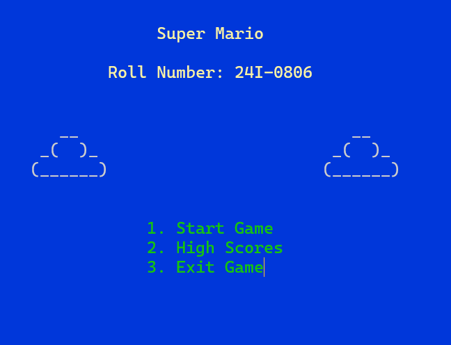

# Super Mario Classic – An x86/MASM Recreation of the 8-bit Legend 🍄

*A faithful assembly-language recreation of the iconic Super Mario Bros. journey from the Mushroom Kingdom to Bowser's Castle!*

Experience the classic platforming adventure rebuilt from the ground up in pure x86 Assembly Language using MASM615 and the Irvine32 library. This project fully implements the course rubric's requirements, including roll-number customizations and creative bonus features.

---

## 📺 Demo Video

▶️ **Watch the gameplay video:**
[YouTube](https://youtu.be/iS1C4xKDqJc)

---

## 🖼️ Screenshots

<p align="center">
  
  
  <br>
  <em>The title screen and World 1-1 gameplay with the rain weather system.</em>
</p>

<p align="center">
  
  
  <br>
  <em>The hidden Star Room and the final battle against Bowser.</em>
</p>

---

## 🛠 Features

### 🎮 Core Gameplay & Mechanics
- **Complete Mario Movement**: Smooth left/right movement with realistic acceleration and deceleration. Variable-height jumps based on button press duration.
- **Advanced Physics**: Gravity simulation, platform collision, and momentum-based movement built with low-level logic.
- **Combat & Power-ups**:
    - **Fire Master Mario**: Customization for roll number **24I-0806** grants Mario blue fireballs from the start.
    - **Double Fireball Ability**: Manage two active projectiles (`ballActive[0]` and `ballActive[1]`) to overwhelm enemies.
    - **Fireball Collision System**: Precise detection for defeating Goombas, Koopas, and damaging Bowser.

### 🏰 Level Design
- **Four Classic Stages**: Faithfully recreated with platform layouts, enemies, and challenges.
    - **World 1-1 (Grassland)**: Introduction with Goombas, coins, and the dynamic **Rain Weather System**.
    - **World 1-2 (Underground)**: Features Koopa Troopas with shell-kick mechanics and a hidden **Secret Star Room**.
    - **World 1-3 (Sky)**: Focus on precise jumping across floating platforms and gaps.
    - **World 1-4 (Castle)**: Final showdown with Bowser, featuring lava pits, **Moving Platforms**, and fire bar obstacles.

### 👾 Enemies & AI
- **Goomba**: Walks back and forth; defeated by jumping on top.
- **Koopa Troopa**: Can be stomped into a shell, which can then be kicked.
- **Bowser (Boss)**: Features intelligent movement, periodic fireball attacks (`bossShoot` proc), and a multi-hit health system.

### ✨ Bonus & Creative Systems
- **Dynamic Weather**: In World 1-1, rain droplets (`Rain Struct`) fall and damage Mario if touched.
- **Secret Star Room**: A hidden area in World 1-2 containing bonus coins and a star, accessed through a special block.
- **Intelligent Boss Arena**: Castle level includes a **moving floating platform** that Mario can ride, controlled by dedicated variables (`floatingPlatformX`, `floatingPlatformDir`).

### 🎵 Audio & Polish
- **Full Soundtrack**: Unique background music tracks for overworld, underground, and castle levels.
- **Sound Effects**: For jumping, collecting coins, defeating enemies, firing projectiles, and power-ups.
- **Complete Game States**: Robust flow between Title Screen, Main Menu, Gameplay, Pause, Win, and Lose states.

### 📊 Scoring & Progression
- **Complex Scoring System**: Points for coins, enemies, time remaining, and flagpole height.
- **Bonus Calculation**: The `calculateBonus` procedure awards points for quick level completion and enemy combos.
- **Persistent HUD**: On-screen display for Score, Coins, World, Time, and Lives.

---

## 🎮 Controls

| Action | Key |
| :--- | :--- |
| Move Left | `A` |
| Move Right | `D` |
| Jump | `Spacebar` |
| Shoot Fireball | `F` |
| Pause / Unpause | `P` |
| Exit to Menu (when paused) | `E` |

> **Developer Note**: The boss battle was nearly impossible to test before implementing the double-fireball system. Managing two projectile slots was the key to creating a fair and fun fight!

---

## 📁 Project Structure

```
SuperMario-MASM/
│
├── mario.asm                  # Main game source file
├── README.md                  # This file
│
├── (Sound Files)              # .WAV files for music and SFX
│   ├── jump.wav
│   ├── coin.wav
│   ├── scene1.wav
│   ├── scene2.wav
│   ├── scene3.wav
│   ├── title.wav
│   └── ...
│
└── highscores.txt            # Planned high score storage
```

### 🧱 Core Code Architecture
The game is built using several key assembly structures that manage the game state and objects:

- **`Character Struct`**: Manages Mario's state (position, power-ups, lives, score).
- **`gameObject Struct`**: A generic template for enemies, blocks, and power-ups.
- **`Scene Struct`**: Contains all data for a level (enemies, platforms, coins).
- **`Projectile Struct`**: Handles the fireballs shot by Mario and Bowser.

---

## ⚙️ Dependencies & Build Instructions

### **Prerequisites**
- **MASM615** Assembler
- **Irvine32** Library
- **Windows OS**
- **winmm.lib** (for sound playback)

### **Build & Run (Using Visual Studio)**
1.  Ensure the Irvine32 library is correctly set up in your Visual Studio project paths.
2.  Add `winmm.lib` to your linker dependencies.
3.  Open the project file (e.g., a `.sln` or `.asm` project).
4.  Assemble and link the `mario.asm` file.
5.  Run the executable. All sound files (.wav) must be in the same directory as the executable.

---

## 👨‍💻 Developer

**Muhammad Mughees Tariq Khawaja**
[LinkedIn](https://linkedin.com/in/mugheestariq)

## 📜 License & Acknowledgments

- This project was developed for educational purposes as part of a **Computer Organization & Assembly Language** course.
- Super Mario Bros. is a trademark of Nintendo. All game concepts and designs are the property of their respective owners.
- This implementation is a tribute and a technical demonstration built purely in x86 Assembly.

## 🎯 About the Project

This is a complete, low-level recreation of a classic platformer built in **x86 Assembly (MASM)**, featuring custom game mechanics, enemy AI, and a full audio system. It demonstrates mastery of assembly programming, memory management, and hardware-level interaction.
